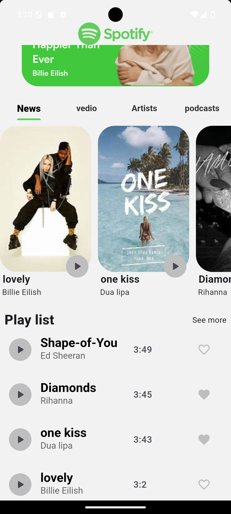
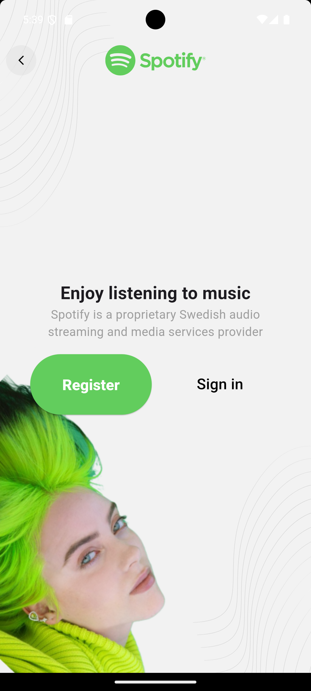
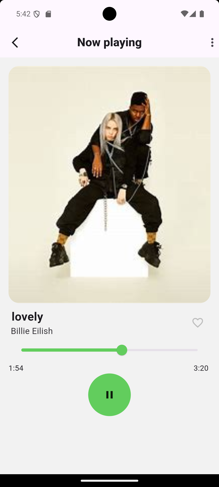

# 🎵 Spotify Clone

A fully-featured **Spotify Clone** built with Flutter, replicating the core music streaming experience with a modern UI and robust architecture.

---

## 📱 Screenshots

> _Add your screenshots here_

| Home | Login | Player |
|------|-------|--------|
|  |  |  |

---

## ✨ Features

- 🔐 **Authentication** — Sign up & login with Firebase Auth
- 🎵 **Music Streaming** — Play, pause, skip tracks with full audio controls
- 🔍 **Browse & Search** — Explore songs, albums, and playlists
- 📚 **Your Library** — Save your favorite tracks and playlists
- 🖼️ **Dynamic UI** — Skeleton loaders for smooth content loading
- ☁️ **Cloud Storage** — Real-time data sync with Cloud Firestore
- 🎨 **SVG Support** — Crisp, scalable icons and graphics

---

## 🏗️ Architecture

This project follows **Clean Architecture** with **BLoC** pattern for state management.

```
lib/
├── core/
│   ├── di/              # Dependency injection (GetIt)
│   ├── errors/          # Failure handling (Dartz)
│   └── utils/
├── features/
│   ├── auth/
│   │   ├── data/
│   │   ├── domain/
│   │   └── presentation/
│   ├── home/
│   │   ├── data/
│   │   ├── domain/
│   │   └── presentation/
│   └── song_player/
│       ├── data/
│       ├── domain/
│       └── presentation/
└── main.dart
```

---

## 🛠️ Tech Stack

| Category | Technology |
|----------|-----------|
| Framework | Flutter |
| State Management | flutter_bloc |
| Backend | Firebase (Auth + Firestore) |
| Audio | just_audio |
| DI | get_it |
| Functional Programming | dartz |
| Image Loading | cached_network_image |
| UI | flutter_svg, skeletonizer |

---

## 📦 Dependencies

```yaml
dependencies:
  cached_network_image: 3.4.0
  cloud_firestore: ^5.3.0
  cupertino_icons: ^1.0.8
  dartz: ^0.10.1
  firebase_auth: 5.1.4
  firebase_core: 3.4.0
  flutter_bloc: ^8.1.6
  flutter_svg: ^2.0.10+1
  get_it: ^7.7.0
  just_audio: ^0.9.40
  skeletonizer: ^1.4.2
```

---

## 🚀 Getting Started

### Prerequisites

- Flutter SDK `>=3.0.0`
- Dart SDK `>=3.0.0`
- Firebase project setup

### Installation

1. **Clone the repository**
   ```bash
   git clone https://github.com/Abdalah-eslam/SpotifyApp.git
   cd SpotifyApp
   ```

2. **Install dependencies**
   ```bash
   flutter pub get
   ```

3. **Firebase Setup**
   - Create a new Firebase project at [Firebase Console](https://console.firebase.google.com)
   - Enable **Authentication** (Email/Password)
   - Enable **Cloud Firestore**
   - Download `google-services.json` and place it in `android/app/`
   - Download `GoogleService-Info.plist` and place it in `ios/Runner/`

4. **Run the app**
   ```bash
   flutter run
   ```

---

## 🔥 Firebase Configuration

Make sure your Firestore rules are set correctly:

```
rules_version = '2';
service cloud.firestore {
  match /databases/{database}/documents {
    match /{document=**} {
      allow read, write: if request.auth != null;
    }
  }
}
```

---

## 🤝 Contributing

Contributions are welcome! Please feel free to submit a Pull Request.

1. Fork the project
2. Create your feature branch (`git checkout -b feature/AmazingFeature`)
3. Commit your changes (`git commit -m 'Add some AmazingFeature'`)
4. Push to the branch (`git push origin feature/AmazingFeature`)
5. Open a Pull Request

---

## 📄 License

This project is licensed under the MIT License — see the [LICENSE](LICENSE) file for details.

---

## 👨‍💻 Author

**Abdalah Eslam**

[](https://github.com/Abdalah-eslam)

---

> ⭐ If you found this project helpful, please give it a star!
